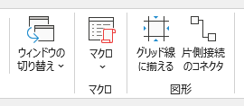

# excel-align-grid-addin

Excelの図形をグリッドに揃えるアドイン

## 使い方

1. excel-align-grid.xlamをExcelアドインとして読み込みます。
2. [表示]タブの右側に[図形]セクションが追加されます。

### グリッド線に揃える

- 図形を選択していない状態で[グリッド線に揃える]を押すとすべての図形をグリッド線に整列します。
- 図形を選択している状態で[グリッド線に揃える]を押すと選択している図形をグリッド線に整列します。

### 片側接続のコネクタ

- 片側だけ図形に接続しているコネクタを探します。

## .xlam編集方法

1. ./src/excel-align-grid.xlsmを編集
2. 編集結果はbasとしてエクスポート
3. Excelで新規ファイルを作成し、basをインポートして./excel-align-grid.xlamとして保存
4. 一時的に./excel-align-grid.xlam.zipとしてから./src/excel-align-grid.xlam/配下をコピー
5. ./excel-align-grid.xlamに名前を戻す